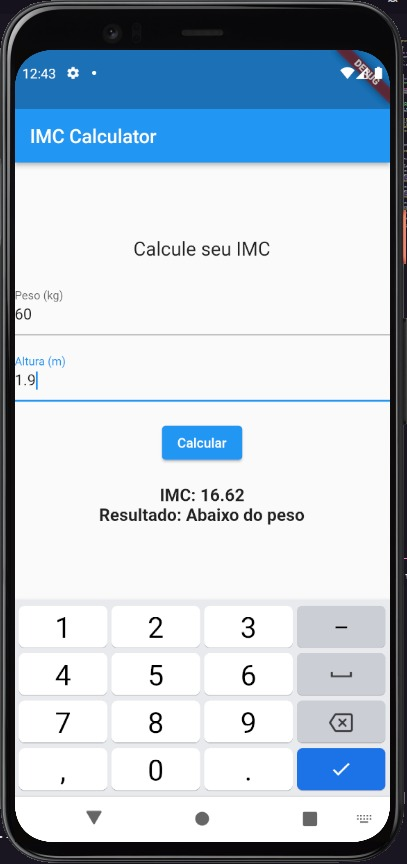

# IMC Calculator App

Um aplicativo de calculadora de IMC (Índice de Massa Corporal) desenvolvido em Flutter.

## Sobre o Aplicativo

Este aplicativo permite que você calcule o seu IMC com base no peso e altura fornecidos. Ele exibirá o resultado do IMC e uma classificação correspondente, como "Abaixo do peso", "Normal", "Sobrepeso" ou "Obeso(a)".

## Capturas de Tela

## Como Usar

1. Clone este repositório para o seu ambiente de desenvolvimento local.
2. Certifique-se de ter o Flutter instalado e configurado no seu ambiente.
3. Abra o projeto no seu editor de código preferido.
4. Execute o comando `flutter run` no terminal para iniciar o aplicativo no seu dispositivo ou emulador.

## Recursos e Funcionalidades

- Interface de usuário simples e intuitiva.
- Campos de entrada para inserir peso e altura.
- Botão de cálculo para calcular o IMC.
- Resultado exibindo o valor do IMC e sua classificação.

## Dependências

Este aplicativo utiliza o framework Flutter para o desenvolvimento da interface de usuário. Não são necessárias dependências adicionais para o funcionamento básico do aplicativo.

## Contribuição

Contribuições são bem-vindas! Sinta-se à vontade para abrir problemas ou enviar solicitações de pull.

## Autor

Nome: [SrMansour01]
GitHub: [SrMansour01](https://github.com/SrMansour01)

